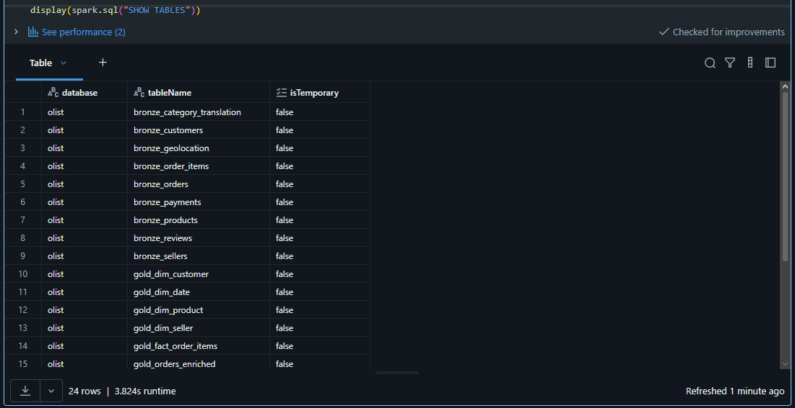
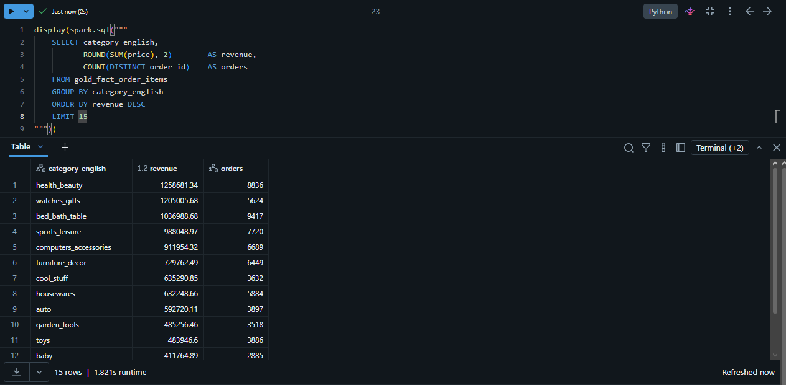
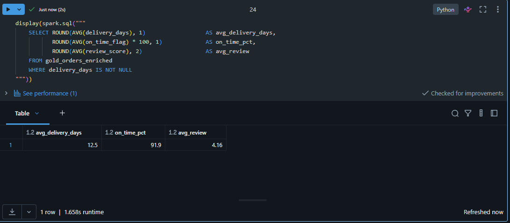

# Data Lake de E-Commerce — Arquitetura Medalhão (Olist)

Pipeline de dados em camadas **Bronze → Silver → Gold** (Delta Lake) sobre a base
pública **Olist** de e-commerce brasileiro (~100 mil pedidos, 2016–2018),
construído em **Databricks** com **PySpark**.

O objetivo é transformar 9 arquivos CSV crus em um modelo dimensional limpo, pronto
para consumo analítico — incluindo data marts de receita, entrega e performance de
vendedores. A camada Gold deste projeto alimenta o
[Dashboard Executivo de Vendas (Power BI)](LINK_DO_OUTRO_REPO).

---

## Arquitetura

```
CSV cru  ──►  BRONZE          ──►  SILVER              ──►  GOLD
(9 arq.)      ingestão fiel        limpo, tipado,           modelo dimensional
              + metadados          deduplicado,             (dim + fato) e
              de ingestão          regras de negócio        data marts de negócio
```



---

## Camadas

**Bronze — ingestão fiel.** Leitura dos 9 CSVs e gravação em Delta sem transformação
de negócio, apenas com metadados de rastreabilidade (`_ingest_timestamp`,
`_source_file`).

**Silver — qualidade e regras de negócio.** Conversão de tipos, deduplicação,
tradução das categorias de produto para inglês, agregação de pagamentos por pedido e
cálculo das métricas de entrega:
- `delivery_days`: dias entre compra e entrega ao cliente.
- `on_time_flag`: 1 se entregue até a data estimada, 0 se atrasou.

**Gold — modelo dimensional + marts.**
- Dimensões: `gold_dim_date`, `gold_dim_product`, `gold_dim_customer`, `gold_dim_seller`.
- Fatos: `gold_fact_order_items` (grão = item de pedido) e `gold_orders_enriched`
  (grão = pedido).
- Marts: `gold_revenue_by_category_month`, `gold_seller_performance`.

---

## Decisões de modelagem

- **Duas granularidades no Gold.** Preço e frete existem por *item*; pagamento,
  avaliação e prazo de entrega existem por *pedido*. Manter as duas tabelas evita
  duplicar valores ao cruzar métricas de níveis diferentes.
- **Categorias traduzidas** via tabela de-para oficial; categorias ausentes viram
  `unknown` em vez de nulo.
- **Uma avaliação por pedido**: quando há mais de uma, mantém-se a mais recente.

---

## Resultados (amostra)

Receita por categoria (top categorias do e-commerce):



Indicadores operacionais de entrega:



---

## Stack

Databricks (Free Edition), PySpark, Delta Lake, SQL.

## Como reproduzir

1. Baixe a base Olist no Kaggle (`olistbr/brazilian-ecommerce`).
2. No Databricks, crie o schema e o volume:
   ```sql
   CREATE SCHEMA IF NOT EXISTS workspace.olist;
   CREATE VOLUME IF NOT EXISTS workspace.olist.raw;
   ```
3. Suba os 9 CSVs em `/Volumes/workspace/olist/raw/`.
4. Importe e execute `pipeline_medalhao_olist.py` de cima para baixo.

## Estrutura do repositório

```
.
├── pipeline_medalhao_olist.py   # notebook do pipeline (bronze/silver/gold)
├── README.md
└── imagens/
    ├── 01_tabelas_medalhao.png
    ├── 02_receita_por_categoria.png
    └── 03_kpis_entrega.png
```
